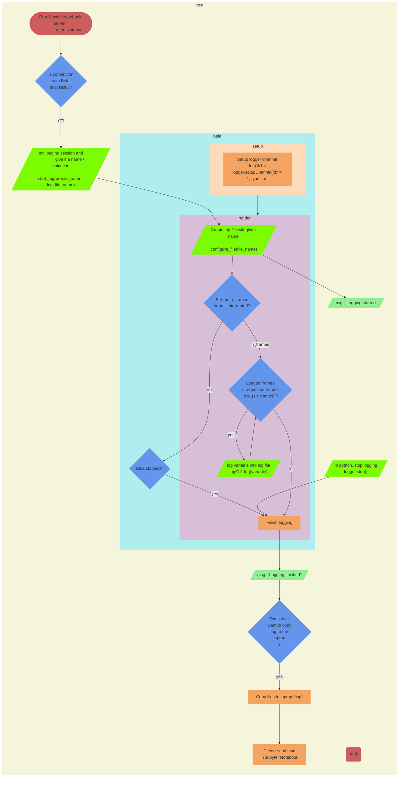

# Logging 
– Log sensor values in a file during an 'extended' period of time. Data is logged in a file in Bela and then transferred to the host machine. 

– Use cases: recording dataset, collecting study data

– Note: In this case, the Jupyter notebook starts the logging session ("triggers" the Bela code). Once the Bela code is interrupted, the logging file is copied from Bela to the host. If the user wants to run the logging program directly from Bela without interfacing with Jupyter notebook, the only notebook's function is to copy the log files from the Bela to the host, which is a more general API case and hence is not included in this document.

