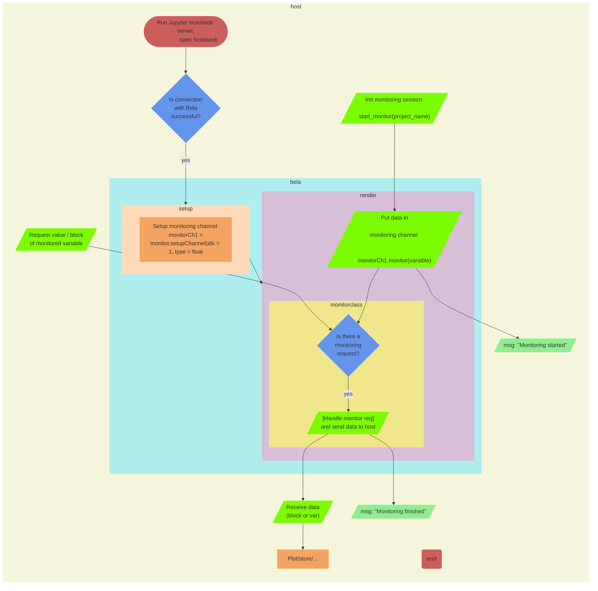

# Monitoring
– Observe variables at specific times. 

– Data is monitored in cpp, and data blocks are sent asynchronously when requested by the Jupyter notebook. Callbacks in Bela set flags when e.g., values change. Flags can be read synchronously in Jupyter notebook. 

– Use cases: Testing sensors at specific times (e.g., sensor rest value, when does a sensor value change), debugging

