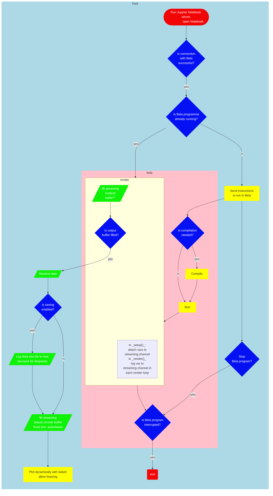

# Streaming

– Watch sensor plots / values in _real-time_ in Jupyter notebook, data is sent synchronously from Bela to the Jupyter notebook.

– Use cases: Testing sensor values over time (.e.g, how a sensor signal behaves after an interaction), sensor calibration.

– In Jupyter notebook, values can be plot dynamically (i.e., as they come). Received data is stored in a buffer, only last n points are kept (for longer windows, use logger).

– Could have callbacks, can act as (less-reliable) logger if 'saving' function is enabled

– Re fill output buffer: could also be done by writing a file in the host and reading it from jupyter notebook as suggested by Giulio.

